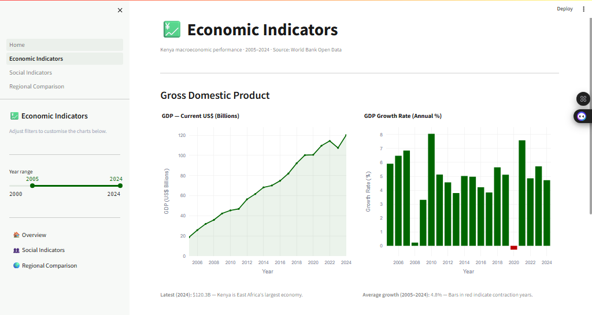
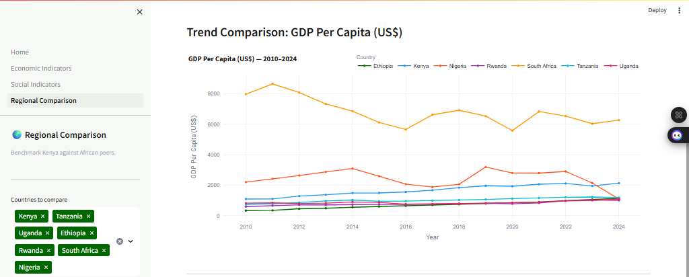
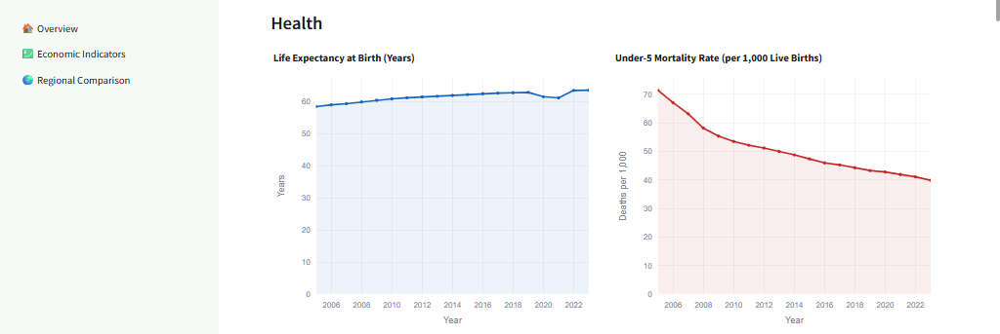

# 🇰🇪 KenyaPulse: Economic & Development Intelligence Dashboard

**KenyaPulse** is a production-grade, interactive data analytics dashboard that transforms raw World Bank Open Data into a compelling, decision-ready intelligence platform. It tracks **14 macroeconomic and social indicators** for Kenya across 25 years, benchmarked against 6 African peer nations, and delivers live insights through a fully containerised Streamlit application.

---

## 🎯 Project Goal
To build a self-contained analytics platform that demonstrates the full spectrum of data storytelling — from automated API ingestion and in-memory caching to interactive multi-page visualisation — using Kenya's real economic and social development data as the subject domain.

---

## 🧬 System Architecture
The dashboard follows a modular **Fetch → Cache → Visualise** pattern:

1. **Data Ingestion:** Python-based polling of the **World Bank Open Data API** (no authentication required) for indicators across economic, social, and infrastructure categories.
2. **Caching Layer:** `@st.cache_data` with a 1-hour TTL prevents redundant API calls on every page interaction, improving responsiveness and reducing external load.
3. **Transformation Layer:** `pandas` DataFrames handle date filtering, null-value removal, unit conversion (e.g., GDP in billions), and min-max normalisation for the radar chart.
4. **Visualisation Layer:** `Plotly` renders 10+ interactive chart types (line, area, bar, donut, multi-line, horizontal bar, radar) with consistent Kenya-themed styling.
5. **Multi-page App:** Streamlit's native page routing organises the dashboard into four focused sections.
6. **Containerisation:** Docker Compose packages the full app into a single portable service.

---

## 📊 Dashboard Sections

| Page | Content |
| :--- | :--- |
| **🏠 Overview** | 6 live KPI metric cards, Kenya narrative, section navigation |
| **💹 Economic Indicators** | GDP, GDP Growth, GDP Per Capita, Inflation, Trade (% GDP), FDI |
| **👥 Social Indicators** | Population, Urban/Rural split, Life Expectancy, Under-5 Mortality, Literacy, Unemployment, Internet Access, Electricity |
| **🌍 Regional Comparison** | Radar chart vs 6 peers, ranked bar charts, multi-country time-series, indicator selector |

---

## 🛠️ Technical Stack
| Layer | Tool / Library | Purpose |
| :--- | :--- | :--- |
| **UI Framework** | Streamlit 1.32.x | Multi-page interactive dashboard |
| **Data Source** | World Bank Open Data API | 14 live macroeconomic & social indicators |
| **Visualisation** | Plotly 5.20.x | Line, bar, donut, radar, and horizontal bar charts |
| **Data Processing** | Pandas 2.2.x, NumPy 1.26.x | Filtering, normalisation, and unit conversion |
| **HTTP Client** | Requests 2.31.x | API calls with timeout and error handling |
| **Containerisation** | Docker & Docker Compose | One-command portable deployment |
| **Language** | Python 3.11 | Core application logic |

---

## 📈 Key Indicators Tracked

**Economic**
- GDP (Current US$) · GDP Growth Rate (%) · GDP Per Capita (US$)
- Inflation, CPI (%) · Trade (% of GDP) · FDI Net Inflows (% of GDP)

**Social & Human Development**
- Population · Urban Population (%) · Life Expectancy (years)
- Under-5 Mortality Rate · Adult Literacy Rate (%) · Unemployment Rate (%)
- Internet Users (%) · Access to Electricity (%)

**Regional Benchmark Countries**
Kenya · Tanzania · Uganda · Ethiopia · Rwanda · South Africa · Nigeria

---

## 📂 Project Structure
```text
kenyapulse/
├── Home.py                         # Entry point — Overview & KPI cards
├── pages/
│   ├── 1_Economic_Indicators.py    # GDP, inflation, trade, FDI
│   ├── 2_Social_Indicators.py      # Population, health, education, digital
│   └── 3_Regional_Comparison.py    # Radar chart + peer benchmarking
├── utils/
│   ├── api.py                      # World Bank API client (cached)
│   └── charts.py                   # Reusable Plotly chart builders
├── config.py                       # Indicators, countries, colours, KPI defs
├── .streamlit/
│   └── config.toml                 # Theme (Kenya green #006600) & server config
├── Dockerfile                      # Python 3.11-slim multi-stage build
├── docker-compose.yml              # One-command deployment
├── requirements.txt                # Pinned Python dependencies
├── .env.example                    # Environment variable reference
└── README.md
```

---

## 📸 Screenshots

### 💹 Economic Indicators — GDP


### 💹 Economic Indicators — GDP Per Capita


### 💹 Economic Indicators — Trend


### 👥 Social Indicators


### 👥 Social Indicators — Health


### 👥 Social Indicators — Digital Infrastructure & Electricity Access


### 🌍 Regional Comparison — Digital & Infrastructure


### 🌍 Regional Comparison — Country Performance


---

## ⚙️ Installation & Setup

### Option A — Docker Compose (Recommended)
```bash
git clone https://github.com/declerke/Kenya-Pulse.git
cd kenyapulse

# Build and start the container
docker-compose up -d

# View logs
docker-compose logs -f kenyapulse
```
Open your browser at **http://localhost:8501**

---

### Option B — Local Python Environment
```bash
git clone https://github.com/declerke/Kenya-Pulse.git
cd kenyapulse

# Create and activate virtual environment
python -m venv .venv
# Windows:
.venv\Scripts\activate
# macOS/Linux:
source .venv/bin/activate

# Install dependencies
pip install -r requirements.txt

# Run the dashboard
streamlit run Home.py
```
Open your browser at **http://localhost:8501**

---

## 📊 Performance & Results
- **14 indicators** tracked across up to 25 years of historical data per metric
- **7 countries** compared simultaneously in the regional benchmarking section
- **1-hour TTL cache** prevents redundant API calls — dashboard navigates instantly after initial load
- **100% free, zero-auth data source** — fully reproducible by anyone with an internet connection
- **Radar normalisation** correctly handles indicators with incompatible units (US$, %, years) on a shared [0, 1] scale

---

## 🎓 Skills Demonstrated
- **Data Storytelling:** Translating 14 raw World Bank indicator codes into a coherent, decision-ready narrative for Kenya's economic and social trajectory
- **API Integration:** Designing a fault-tolerant, cached HTTP client with timeout handling and graceful null-value management
- **Interactive Visualisation:** Building 10+ Plotly chart types (line, area, bar, donut, radar, horizontal bar, multi-line) with a consistent design system
- **Streamlit Multi-page Architecture:** Structuring a production-grade multi-page app with shared utilities, sidebar navigation, and per-page filter state
- **Full-Stack Deployment:** Containerising the app with Docker Compose for zero-friction reproducibility
- **Kenya Domain Knowledge:** Contextualising every chart with data-backed narrative specific to Kenya's economic and development context
